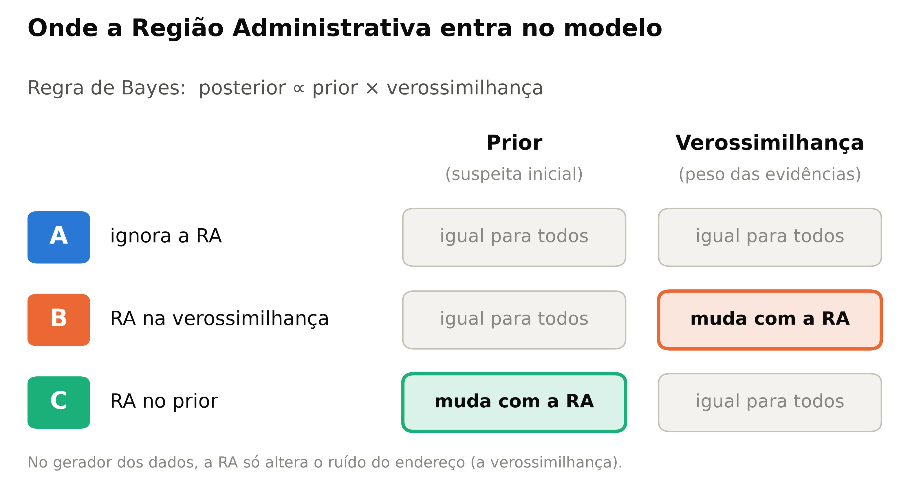
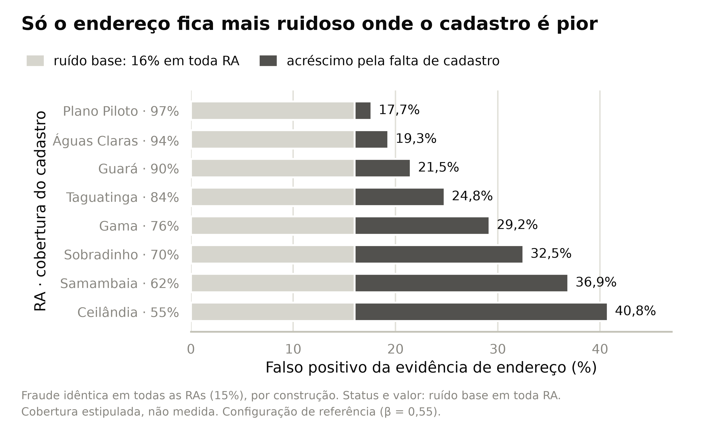
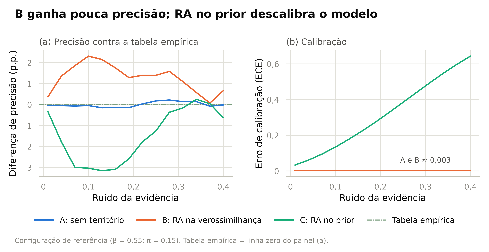
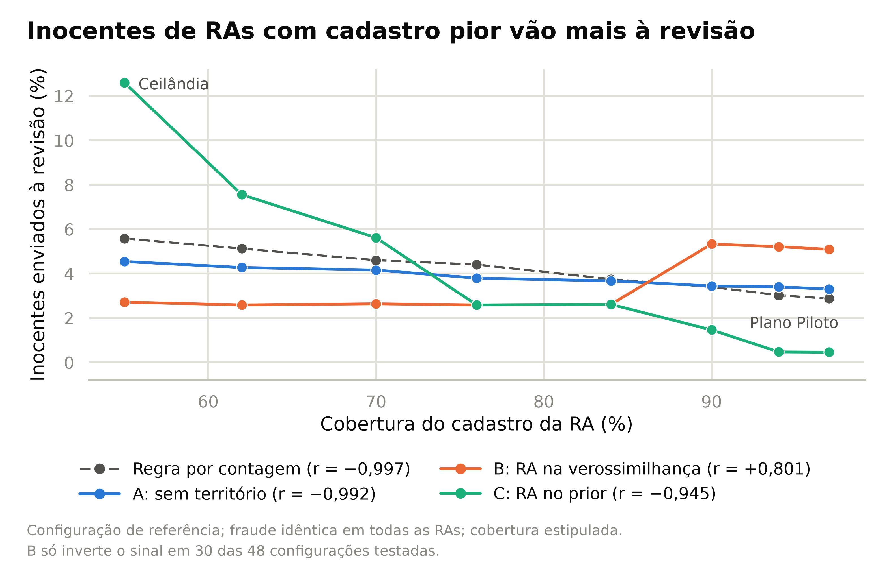
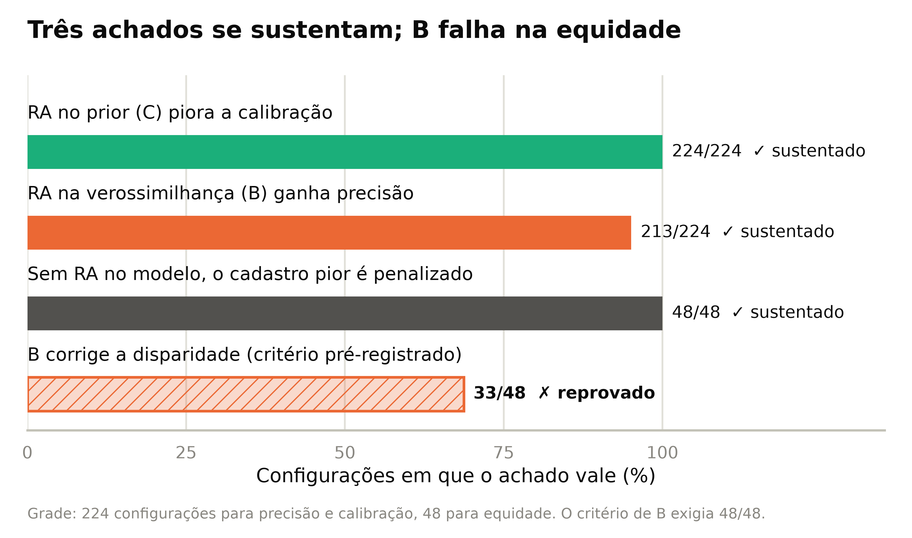
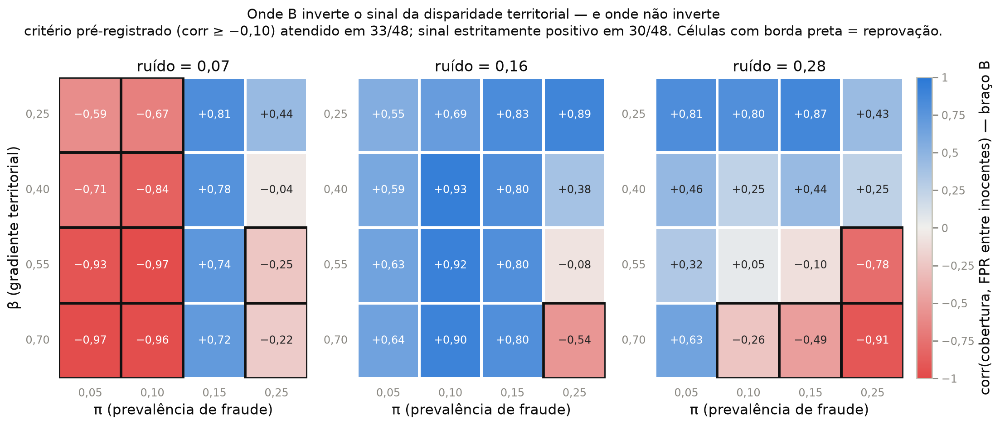
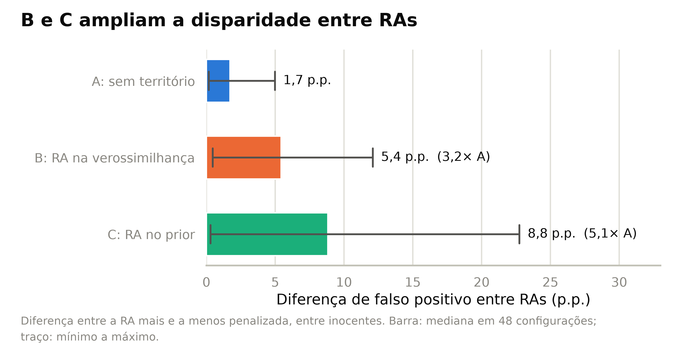

# Bayes, RAs e Viés: Influência da Localidade na Triagem de Crédito

Pesquisa de Iniciação Científica sobre triagem explicável de inconsistências cadastrais e
documentais em análise de crédito no DF/RIDE, combinando recuperação de evidências (RAG),
tipificação simbólica e inferência bayesiana. Esta etapa responde a uma pergunta anterior à
construção do sistema: **onde o dado territorial deve entrar em um modelo bayesiano de
triagem, no prior ou na verossimilhança?**

- **Coordenador:** Filipe Balduino Pires Fernandes
- **Estudantes:** Roger Dias Quinelato e João Victor Rikio Enomoto
- **Instituição:** Escola Superior de Engenharia, Tecnologia e Inovação (ESETI/UnDF)
- **Apresentado em:** 32º Congresso de Iniciação Científica da UnB e 23º do Distrito Federal
- **Apoio:** UnDF e CNPq

> **Uso restrito a pesquisa.** Todos os dados são sintéticos. Nada neste repositório deve ser
> usado para conceder, negar ou decidir qualquer operação real de crédito.

---

## A pergunta

A proposta original do projeto tinha duas hipóteses em conflito. A **H3** previa calibrar o
prior com dados territoriais locais, por serem mais informativos. A **H2** previa que o
sistema reduziria vieses contra populações vulneráveis. Um prior condicionado à Região
Administrativa (RA) eleva a suspeita inicial de quem mora em certas regiões antes de o caso
ser examinado. Esta etapa transforma esse conflito em experimento.


*Figura 1. Onde cada variante do modelo insere a Região Administrativa.*

## Como foi feito

Como a fraude é uma variável latente e não existe base pública rotulada, o estudo usa
**simulação de um mecanismo causal**: a probabilidade verdadeira de cada caso é conhecida, o
que permite medir calibração. A fraude tem a **mesma probabilidade (15%) nas oito RAs**, e
essa igualdade é o controle do experimento. Das três evidências documentais (situação
cadastral, endereço e valor declarado), só o endereço depende da região: o falso positivo
dele cresce onde a cobertura do cadastro territorial é menor. Por isso, qualquer disparidade
entre regiões nos resultados vem da qualidade do dado, nunca da população.


*Figura 2. Falso positivo da evidência de endereço por RA, conforme a cobertura cadastral
(estipulada, não medida).*

O sistema não concede nem nega crédito: ele ordena uma fila de revisão humana. Por isso as
métricas são o escore de Brier, o erro de calibração esperado (ECE), a precisão nos 10% de
casos mais suspeitos e a fração de inocentes enviados à revisão em cada RA. Foram comparadas
seis abordagens: duas regras determinísticas, uma tabela empírica usada como teto de
referência e três variantes bayesianas do método de Fellegi-Sunter, **A** (sem território),
**B** (RA na verossimilhança) e **C** (RA no prior). A varredura cobriu **224 configurações**,
cada uma com 8 repetições de 40.000 casos, com critérios de aceitação declarados antes da
execução.

## Resultados

**Bayes sem território não ganha nada, e território no prior quebra a calibração.** A
variante A empata com a tabela empírica (diferença mediana de 0,06 p.p. na precisão). A
variante B ganha pouco: +0,67 p.p. na mediana, positivo em 213 de 224 configurações. A
variante C piorou Brier e ECE em **224 de 224** configurações; na configuração de referência,
o ECE vai de 0,0025 para 0,2255. O mecanismo é dupla contagem: a taxa da região que calibra o
prior é produzida pelas mesmas evidências que depois entram na verossimilhança.


*Figura 3. Precisão sob orçamento contra a tabela empírica (a) e erro de calibração (b).*

**A discriminação territorial aparece sem nenhuma variável demográfica.** Com a mesma taxa de
fraude em todas as regiões, a regra por contagem envia à revisão 5,6% dos inocentes de
Ceilândia contra 2,9% dos do Plano Piloto (correlação de −0,997 entre cobertura e falso
positivo, repetida em 48 de 48 configurações). O prior regional amplia a diferença para 12,6%
contra 0,5%.


*Figura 4. Fração de inocentes enviados à revisão em cada RA, segundo a cobertura cadastral.*

**Mover a RA para a verossimilhança não resolve a equidade.** A variante B atendeu ao
critério pré-registrado em apenas 33 de 48 configurações, quando o critério exigia todas. As
falhas se concentram em ruído baixo com gradiente territorial íngreme e em ruído alto com
prevalência alta. O achado reprovado foi mantido com o mesmo destaque dos demais.


*Figura 5. Fração das configurações testadas em que cada achado se sustenta.*


*Figura 6. Onde a variante B atende ou não ao critério de equidade, por ruído, gradiente
territorial (β) e prevalência de fraude (π). Células com borda preta não atendem.*

## Conclusão

A posição do dado territorial importa mais do que o uso da inferência bayesiana em si. No
prior, degrada a calibração e concentra o falso positivo nas regiões de cadastro precário. Na
verossimilhança, melhora um pouco a precisão, mas não resolve a equidade: a diferença entre a
RA mais e a menos penalizada é de 1,7 p.p. em A, 5,4 p.p. em B e 8,8 p.p. em C.


*Figura 7. Diferença de falso positivo entre a RA mais e a menos penalizada, por variante.*

Enquanto a cobertura cadastral variar entre as RAs, qualquer sistema que use o endereço como
evidência penalizará quem mora onde o registro é pior, inclusive os construídos para serem
neutros. Medir e publicar essa cobertura por RA é requisito de governança.

**Limitações.** É um estudo de simulação: valem as direções dos efeitos, não os tamanhos
exatos. A cobertura cadastral por RA foi estipulada; obtê-la no Geoportal/SEDUH é o próximo
passo. A camada de recuperação de evidências (RAG) ainda não foi integrada.

---

## Estrutura do repositório

| Caminho | Conteúdo |
|---|---|
| `experimento/` | `gerador.py` (mecanismo causal), `bracos.py` (seis abordagens fechadas), `bracos_ml.py` (três braços AdaBoost), `metricas.py`, `varredura.py`, `equidade.py`, `exportar_dataset.py` e os scripts de figura (`figuras.py`, `figuras_relatorio.py`, `figuras_poster.py`) |
| `relatorios/` | Relatório técnico, benchmark de estado da arte, ledger de números auditados, guia das figuras e tabelas de apoio |
| `figuras/` | Figuras do pôster (as demais são regeradas pelos scripts) |
| `Proposta_PIDTI_RAG_Bayesiano2.pdf` | Proposta do projeto: hipóteses H1 a H3, arquitetura e cronograma |
| `CLAUDE.md` | Guia de trabalho detalhado: achados verificados, decisões metodológicas e convenções |

## Como reproduzir

O experimento é determinístico por semente. Com os braços AdaBoost, leva perto de uma hora:

```bash
pip install numpy matplotlib pandas seaborn scikit-learn==1.9.1
python experimento/varredura.py && python experimento/equidade.py
python experimento/figuras.py && python experimento/figuras_relatorio.py && python experimento/figuras_poster.py
```

`varredura.py` e `equidade.py` escrevem `resultados/`; os scripts de figura leem `resultados/`
e escrevem `figuras/`. O núcleo do experimento usa só `numpy`; o `scikit-learn` entra apenas
nos três braços AdaBoost (`bracos_ml.py`), que são treinados com metade de cada amostra e
avaliados na outra metade. A verificação é a reexecução: duas rodadas produzem CSVs e PNGs
idênticos (com a mesma versão do `scikit-learn`). Para gerar um dataset de casos com a fraude
latente:

```bash
python experimento/exportar_dataset.py 5000   # escreve dataset_sintetico_v2.csv
```

## Referências principais

- AKPINAR, N.-J.; LIPTON, Z. C.; CHOULDECHOVA, A. The impact of differential feature
  under-reporting on algorithmic fairness. FAccT, 2024. arXiv:2401.08788.
- FELLEGI, I. P.; SUNTER, A. B. A theory for record linkage. *Journal of the American
  Statistical Association*, v. 64, p. 1183-1210, 1969.
- LEWIS, P. et al. Retrieval-augmented generation for knowledge-intensive NLP tasks. NeurIPS,
  2020. arXiv:2005.11401.
- TORRES, D.; CHENG, W.; HUANG, H. FinAbstain: uncertainty-calibrated multimodal RAG for
  selective financial forecasting. arXiv:2607.24875, 2026.

A lista completa, verificada contra as fontes, está em
`relatorios/Relatorio_Benchmark_Estado_da_Arte.md`.
